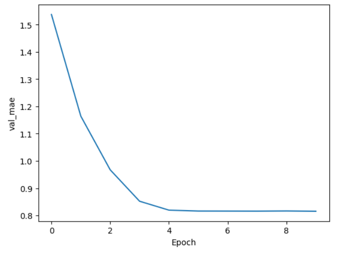
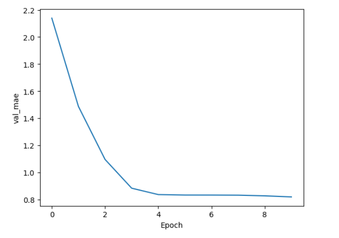
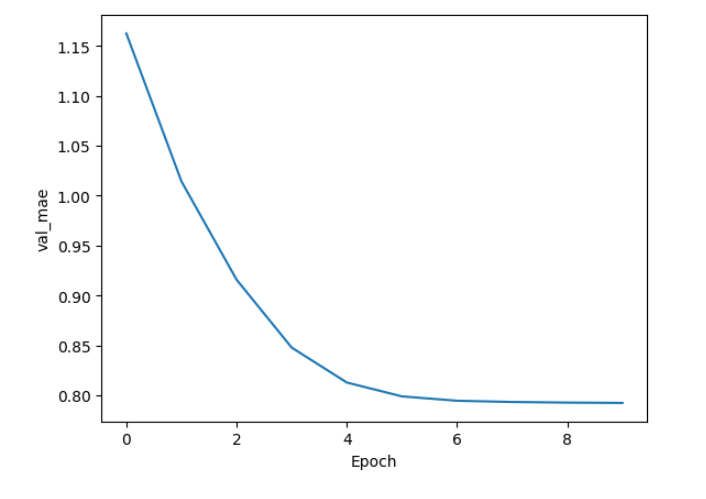

# Predição de Indicador de Saúde Mental com Redes Neurais MLP

## Visão Geral

Este projeto implementa uma Rede Neural Multicamadas (MLP) para prever o **mental_health_score** de usuários da Geração Z com base em padrões de uso de redes sociais.

O modelo foi treinado utilizando um conjunto de dados sintético com 1.000.000 de amostras, gerado a partir de distribuições estatísticas que simulam relações realistas entre comportamento digital e bem-estar mental.

---

## Dataset

O conjunto de dados foi desenvolvido para possibilitar estudos relacionados a:

* Padrões de uso de redes sociais entre membros da Geração Z;
* Relação entre tempo de tela e saúde mental;
* Classificação de níveis de dependência digital;
* Segmentação de usuários com base em características comportamentais;
* Comparação de padrões de comportamento entre diferentes regiões.

### Atributos

O dataset contém informações como:

* Idade
* Gênero
* País de residência
* Tempo médio diário de uso das redes sociais
* Plataforma mais utilizada
* Número de plataformas utilizadas
* Principal motivo de uso
* Duração média das sessões
* Uso durante a noite
* Nível de dependência digital
* Tempo gasto em redes sociais antes de dormir
* Indicador de saúde mental (*mental_health_score*)

### Estrutura do Dataset


### Exemplo de Registros


---

## Metodologia

### Pré-processamento

As variáveis categóricas foram convertidas para formato numérico utilizando One-Hot Encoding:

```python
X = pd.get_dummies(X)
```

Em seguida, os dados foram normalizados utilizando:

```python
scaler = StandardScaler()
```

A divisão dos dados foi realizada da seguinte forma:

* 70% para treinamento
* 15% para validação
* 15% para teste

### Métrica de Avaliação

Por se tratar de um problema de regressão, a métrica *accuracy* não é adequada.

Foi utilizado o **Erro Médio Absoluto (MAE)** como medida de desempenho:

[
MAE = \frac{1}{n}\sum |y_{real} - y_{predito}|
]

Quanto menor o valor do MAE, melhor a capacidade preditiva do modelo.

---

## Arquiteturas Avaliadas

### Modelo 1

```python
Dense(16, activation="relu")
Dense(8, activation="relu")
Dense(1)
```

### Modelo 2

```python
Dense(32, activation="relu")
Dense(16, activation="relu")
Dense(8, activation="relu")
Dense(1)
```

### Modelo 3 (Melhor Resultado)

```python
Dense(128, activation="relu")
Dense(64, activation="relu")
Dense(32, activation="relu")
Dropout(0.2)
Dense(1)
```

---

## Configuração de Treinamento

```python
epochs = 10
batch_size = 256
optimizer = "adam"
loss = "mse"
metric = "mae"
```

O tamanho do lote (*batch size*) foi aumentado para 256 devido ao grande volume de dados, reduzindo o tempo de treinamento e mantendo a estabilidade do processo de aprendizagem.

---

## Resultados

### Arquitetura (16, 8)



### Arquitetura (32, 16, 8)



### Arquitetura (128, 64, 32)



O melhor desempenho foi obtido pela arquitetura com três camadas ocultas:

```text
128 → 64 → 32 → 1
```

Resultado final:

```text
MAE de validação: 0,7827
```

Isso significa que o modelo apresenta um erro médio inferior a um ponto ao prever o indicador de saúde mental em uma escala de 1 a 10.

A proximidade entre as métricas de treinamento e validação indica boa capacidade de generalização e ausência de sobreajuste significativo (*overfitting*).

---

## Instalação

```bash
pip install tensorflow pandas scikit-learn matplotlib
```

---

## Execução

```bash
python main.py
```

---

## Estrutura do Projeto

```text
.
├── genz_social_media_usage_1M.csv
├── main.py
├── README.md
└── images
    ├── features.png
    ├── sample.png
    ├── mlp_16_8.png
    ├── mlp_32_16_8.png
    └── mlp_128_64_32.png
```
